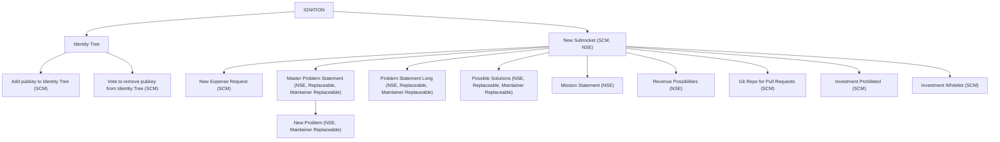

# Event Tree
The event tree is a tree of Nostr Events with `503941a9939a4337d9aef7b92323c353441cb5ebe79f13fed77aeac615116354` as the root.

```mermaid
flowchart TD;
IGNITION-->IDT[Identity Tree]
IDT-->IDTA["Add pubkey to Identity Tree (SCM)"]
IDT-->IDTR["Vote to remove pubkey from Identity Tree (SCM)"]
IGNITION-->NSR["New Subrocket (SCM, NSE)"]
NSR-->SRE["New Expense Request (SCM)"]
NSR-->SRPROBLEM["Master Problem Statement (NSE, Replaceable, Maintainer Replaceable)"]
SRPROBLEM-->SRSP["New Problem (NSE, Maintainer Replaceable)"]
NSR-->SRPROBLEMLONG["Problem Statement Long (NSE, Replaceable, Maintainer Replaceable)"]
NSR-->SRSOLULTION["Possible Solutions (NSE, Replaceable, Maintainer Replaceable)"]
NSR-->SRMISSON["Mission Statement (NSE)"]
NSR-->SRREVEUNE["Revenue Possibilities (NSE)"]
NSR-->SRGIT["Git Repo for Pull Requests (SCM)"]
NSR-->SRINVESTPROHIBIT["Investment Prohibited <bool> (SCM)"]
NSR-->SRWHITELIST["Investment Whitelist <pubkeys> (SCM)"]
```
