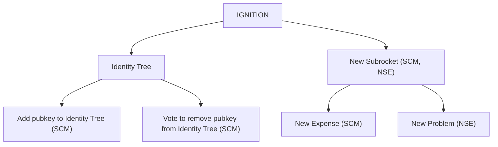

# Event Tree
The event tree is a tree of Nostr Events with `503941a9939a4337d9aef7b92323c353441cb5ebe79f13fed77aeac615116354` as the root.

ROOT
- KIND 1 EVENTS (in reply to ROOT)
  > These are only used for the main Nostrocket website and are not used for anything else.

